

  

# API RESTful con Laravel

Esta es una API RESTful construida con Laravel que permite registrar usuarios, iniciar sesión, gestionar posts y usar tokens de autenticación mediante **Sanctum**.

---

## Endpoints disponibles

| Método | Endpoint | Descripción |
|--------|---------|-------------|
| POST   | `/api/register` | Registro de usuario |
| POST   | `/api/login` | Login de usuario |
| POST   | `/api/logout` | Logout (requiere token) |
| GET    | `/api/posts` | Listar posts (requiere token) |
| GET    | `/api/posts/{id}` | Mostrar post por ID (requiere token) |
| POST   | `/api/posts` | Crear post (requiere token) |
| PUT/PATCH | `/api/posts/{id}` | Actualizar post (requiere token) |
| DELETE | `/api/posts/{id}` | Borrar post (requiere token) |

---

## Autenticación

Todos los endpoints, excepto `register` y `login`, requieren **Bearer Token** en el header:

Authorization: Bearer Token
Accept: application/json
Content-Type: application/json

> Los tokens ya están visibles en las capturas de las pruebas.

---

## Pruebas realizadas en Postman

### Registro y Login

**Prueba 1: Registro correcto**  
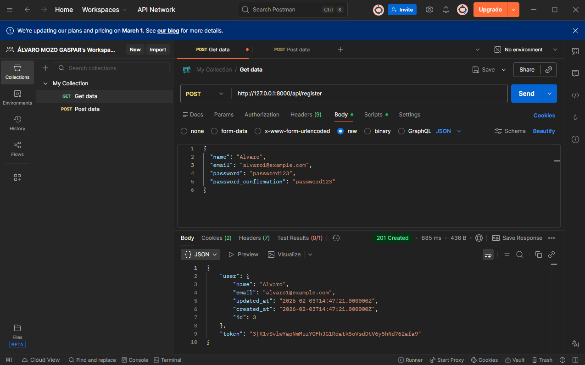

**Prueba 2: Registro email duplicado**  
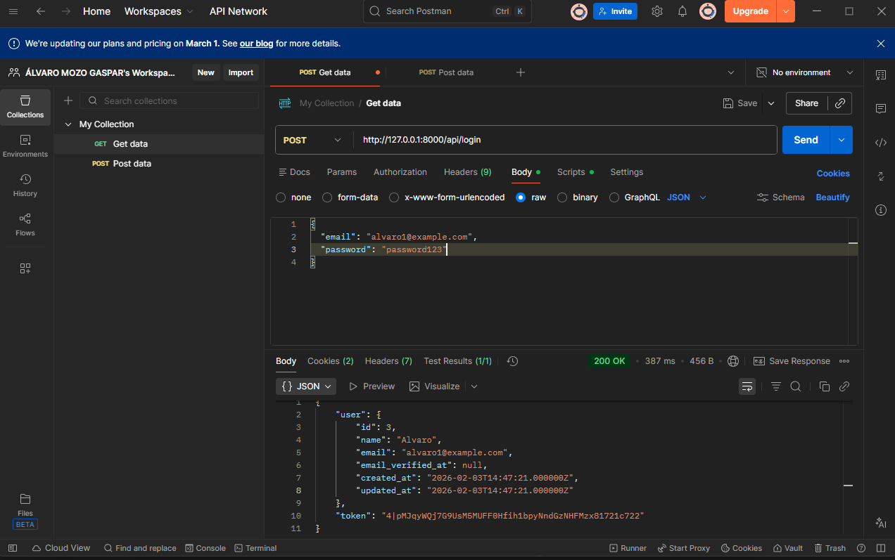

**Prueba 3: Login correcto**  
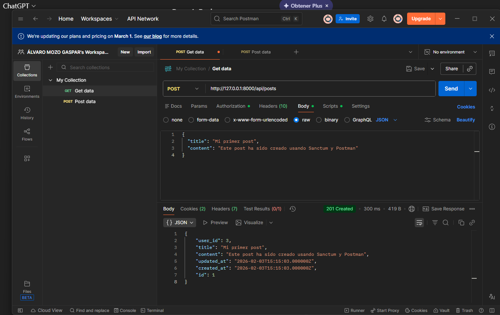

**Prueba 4: Login incorrecto**  
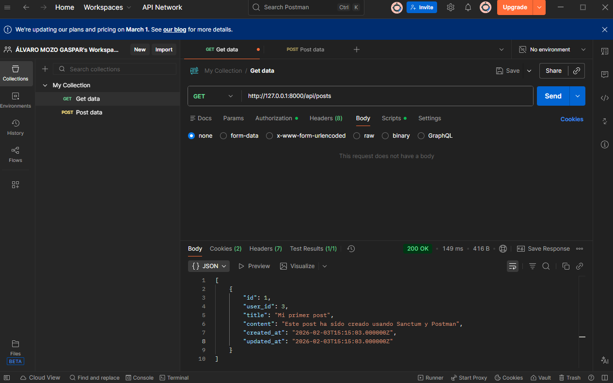

---

### Gestión de Posts

**Prueba 5: GET posts con token**  

**Prueba 6: GET posts sin token**  
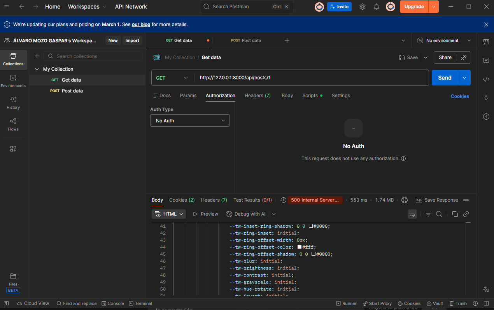

**Prueba 7: GET post con ID inexistente**  
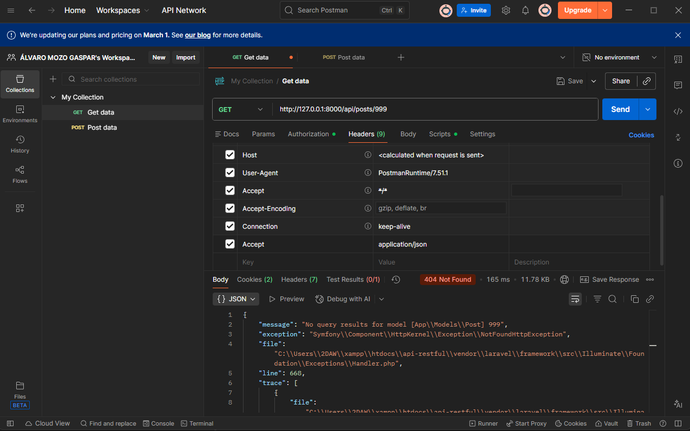

---

### Logout

**Prueba 8: Logout correcto**  
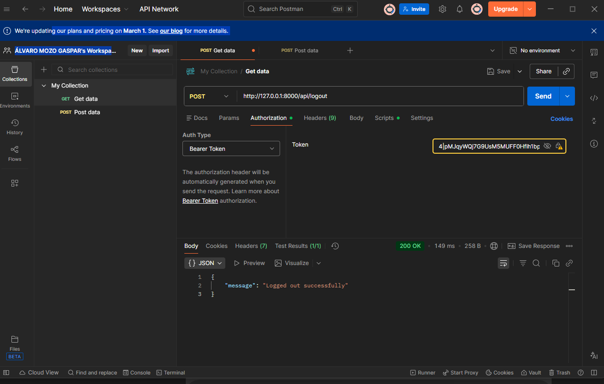

**Prueba 9: Logout sin token**  

**Prueba 10: Logout con token incorrecto**  
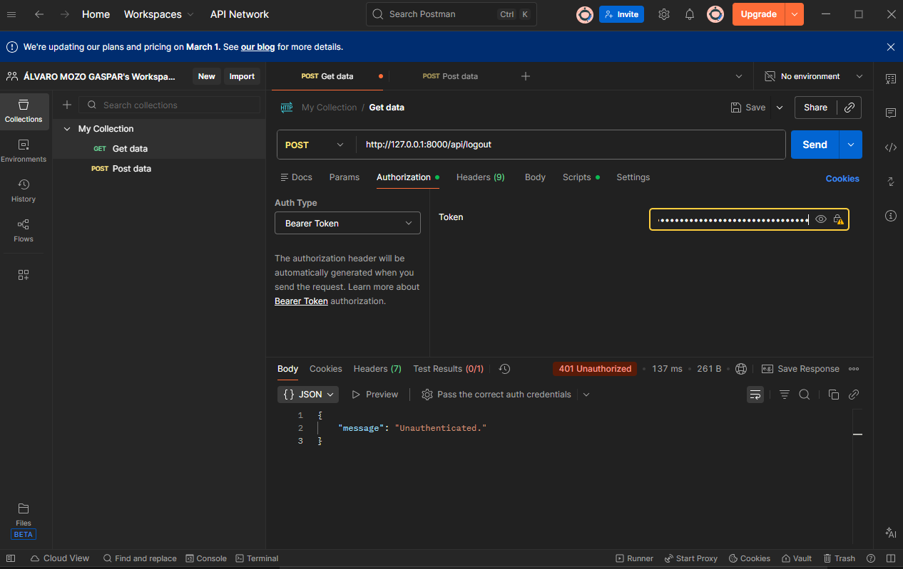

---

### Actualización y Eliminación de Posts

**Prueba 11: PUT post correcto**  
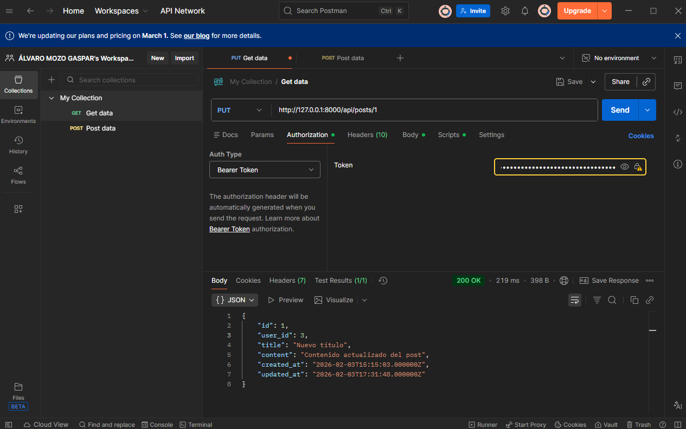

**Prueba 12: PUT sin token**  
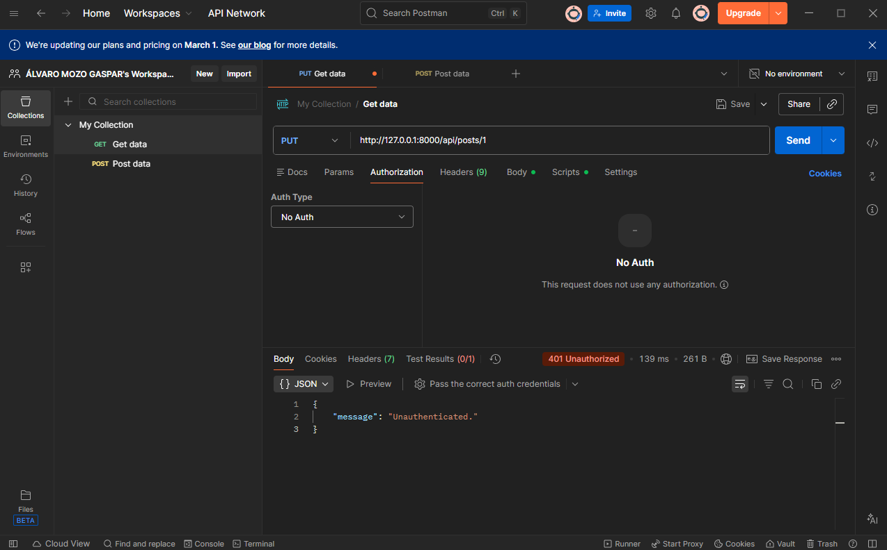

**Prueba 13: PUT con ID inexistente**  
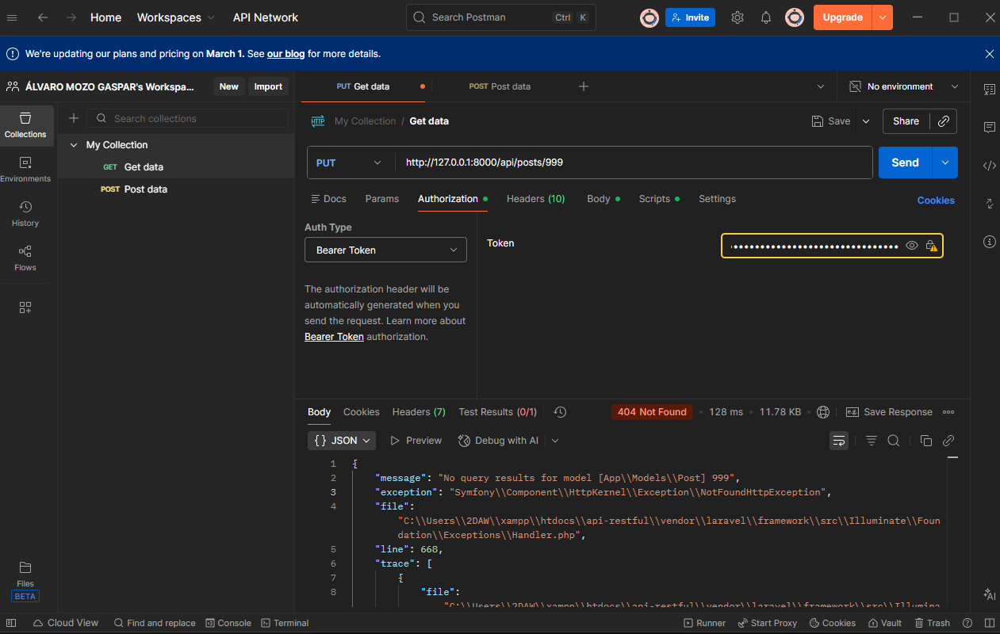

**Prueba 14: DELETE post correcto**  
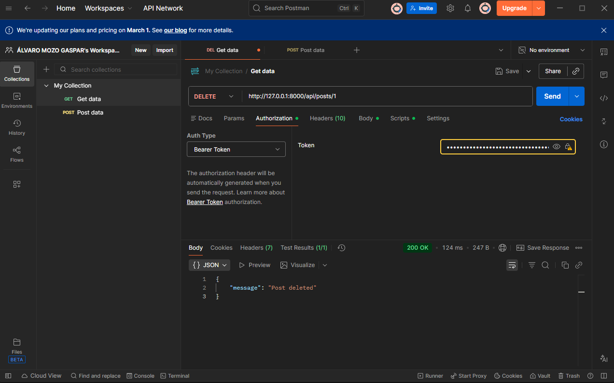

**Prueba 15: DELETE sin token**  

**Prueba 16: DELETE con ID inexistente**  
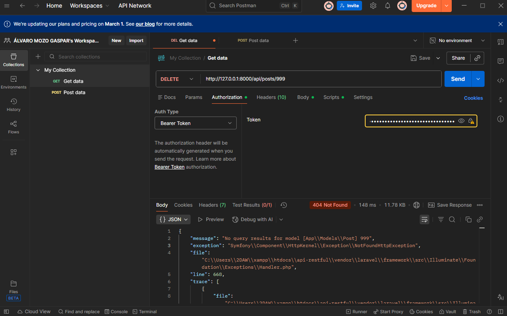

---

**Autoría**

Álvaro Mozo Gaspar